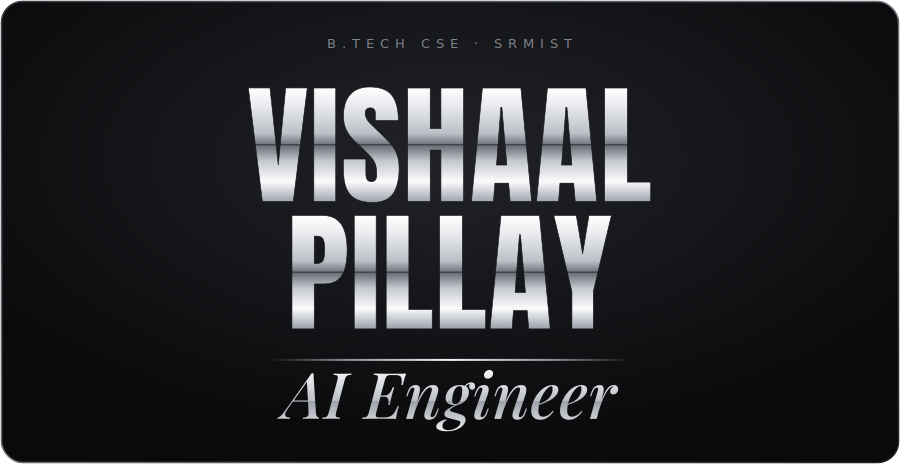

<!-- ============================================================= -->
<!--  VISHAAL PILLAY · README  ·  theme: black / white / chrome    -->
<!--  Header + tech marquee are committed SVGs in /assets          -->
<!-- ============================================================= -->

  

 

  

 

**B.Tech Computer Science · SRM Institute of Science and Technology**

I'm an **AI Engineer** in the making — I build scalable, intelligent systems that bridge
applied machine learning with clean, production-grade full-stack engineering.
From model to interface, I like owning the whole pipeline.

 

`◇ Applied ML & deep learning`&nbsp;&nbsp;·&nbsp;&nbsp;`◇ Full-stack web`&nbsp;&nbsp;·&nbsp;&nbsp;`◇ Scalable backends`&nbsp;&nbsp;·&nbsp;&nbsp;`◇ Clean architecture`

 

<!-- ===================== TECH STACK (rolling) ===================== -->

  <h3>⚙&nbsp;&nbsp;T E C H&nbsp;&nbsp;S T A C K</h3>
  

 

<!-- ===================== GITHUB STATS ===================== -->

  <h3>📊&nbsp;&nbsp;B Y&nbsp;&nbsp;T H E&nbsp;&nbsp;N U M B E R S</h3>

  
  

  

 

<!-- ===================== CONNECT ===================== -->

  <h3>🔗&nbsp;&nbsp;C O N N E C T</h3>

  
  
  

 

<!-- ===================== CONTRIBUTION SNAKE (kept) ===================== -->

  <h3>🐍&nbsp;&nbsp;C O N T R I B U T I O N&nbsp;&nbsp;S N A K E</h3>

<picture>
  <source media="(prefers-color-scheme: dark)" srcset="https://raw.githubusercontent.com/VishaalPillay/VishaalPillay/output/github-snake-dark.svg" />
  <source media="(prefers-color-scheme: light)" srcset="https://raw.githubusercontent.com/VishaalPillay/VishaalPillay/output/github-snake.svg" />
  
</picture>

 
 

<!-- ===================== FOOTER ===================== -->

  

