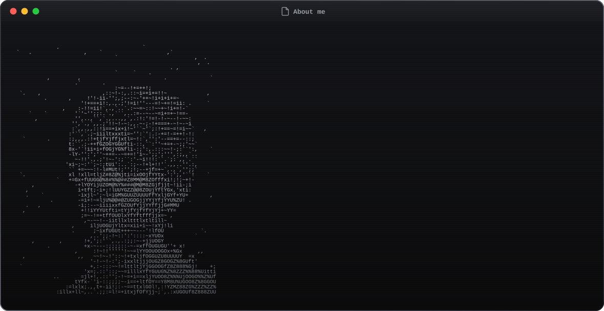

<!-- ============================================================= -->
<!--  VISHAAL PILLAY · README  ·  theme: black / white / chrome    -->
<!--  Terminal hero + tech marquee are generated by /scripts       -->
<!-- ============================================================= -->

<!-- ===================== TERMINAL HERO ===================== -->

  

 

<!-- ===================== TOOLS (rolling) ===================== -->

  
  

 

<!-- ===================== CONTRIBUTIONS ===================== -->

  

<picture>
  <source media="(prefers-color-scheme: dark)" srcset="https://raw.githubusercontent.com/VishaalPillay/VishaalPillay/output/github-snake-dark.svg" />
  <source media="(prefers-color-scheme: light)" srcset="https://raw.githubusercontent.com/VishaalPillay/VishaalPillay/output/github-snake.svg" />
  
</picture>
