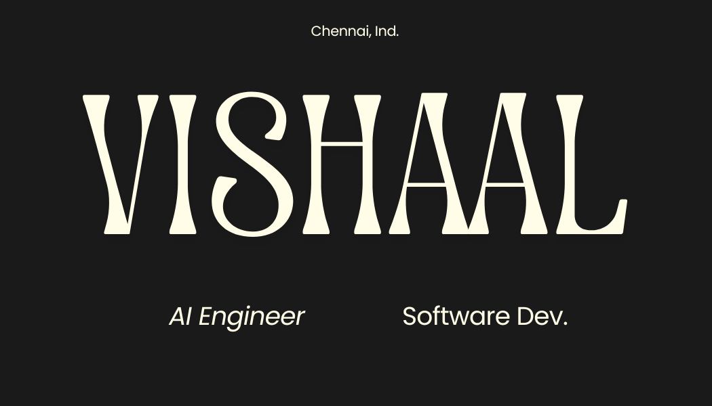
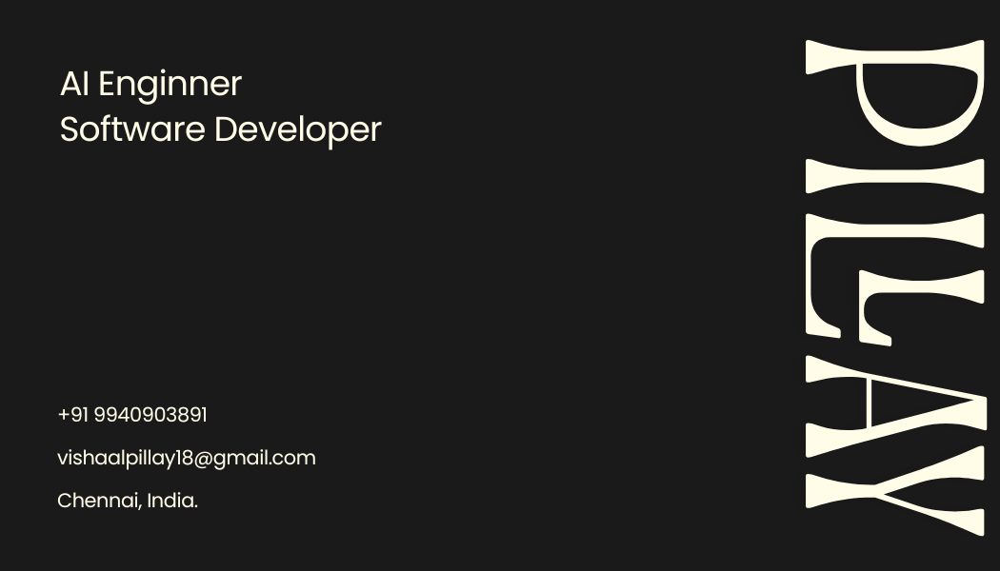

<!-- ============================================================= -->
<!--  VISHAAL PILLAY · README  ·  theme: black / white / chrome    -->
<!--  Header + Footer are custom PNG banners in /assets            -->
<!-- ============================================================= -->

<!-- ===================== HEADER ===================== -->

  

 

<!-- ===================== TYPING TAGLINE ===================== -->

  

 

<!-- ===================== BIO ===================== -->

**B.Tech Computer Science · SRM Institute of Science and Technology**

I build scalable, intelligent systems that bridge applied machine learning with
clean, production-grade full-stack engineering.
From model to interface, I like owning the whole pipeline.

 

`◇ Applied ML & deep learning`&nbsp;&nbsp;·&nbsp;&nbsp;`◇ Full-stack web`&nbsp;&nbsp;·&nbsp;&nbsp;`◇ Scalable backends`&nbsp;&nbsp;·&nbsp;&nbsp;`◇ Clean architecture`

 

<!-- ===================== TECH STACK (rolling) ===================== -->

  <h3><strong>&nbsp;&nbsp;TECHNICAL&nbsp;&nbsp;SKILLS</strong></h3>
  

 

<!-- ===================== CONTRIBUTION SNAKE ===================== -->

  <h3><strong>&nbsp;&nbsp;CONTRIBUTION&nbsp;&nbsp;SNAKE</strong></h3>

<picture>
  <source media="(prefers-color-scheme: dark)" srcset="https://raw.githubusercontent.com/VishaalPillay/VishaalPillay/output/github-snake-dark.svg" />
  <source media="(prefers-color-scheme: light)" srcset="https://raw.githubusercontent.com/VishaalPillay/VishaalPillay/output/github-snake.svg" />
  
</picture>

 
 

<!-- ===================== FOOTER ===================== -->

  

